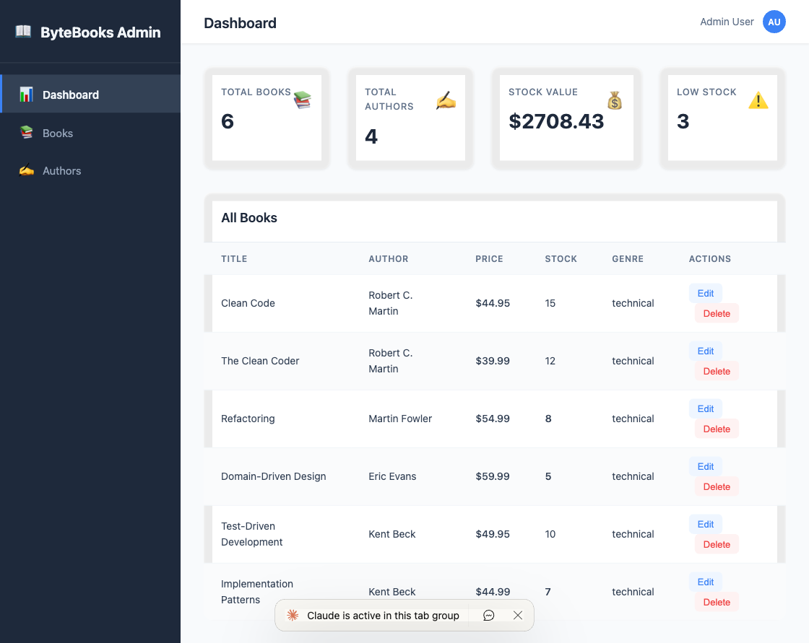
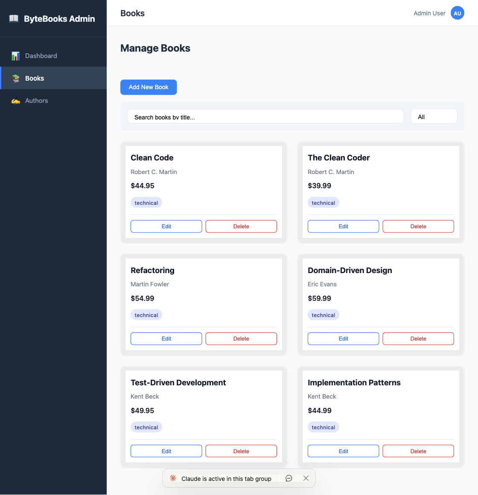
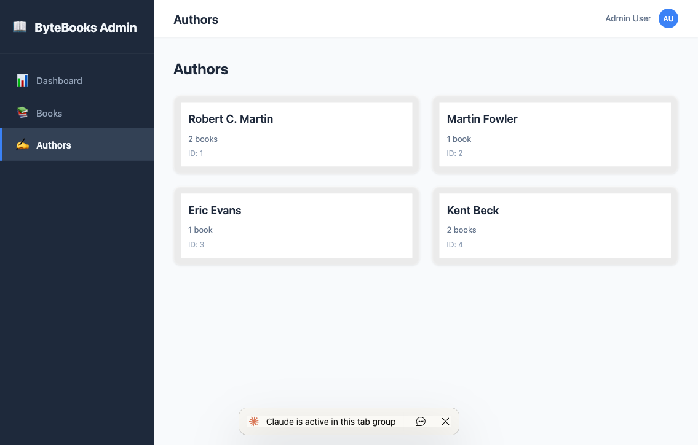

# Week 6 - Web Programming: React Frontend Development

This week builds on the FastAPI backend from Week 4 by creating a complete React frontend in two progressive sessions. Students start with core CRUD operations and evolve the app into a professional SaaS-style admin dashboard.

## What You Will Learn

### Session 1 (v1) - React CRUD Fundamentals

- **Controlled Components**: Every form input is driven by React state (`value` + `onChange`), making React the single source of truth for form data
- **State Management with `useState`**: Managing multiple related states (books array, loading flag, error message, form fields, view mode)
- **Side Effects with `useEffect`**: Fetching data from an API on component mount with cleanup patterns
- **Lifting State Up**: Keeping shared state in a common parent (`BookList`) so child components stay in sync
- **Conditional Rendering**: Switching between list view, add form, and edit form using mode state
- **Event Handling**: Form submission with `preventDefault()`, click handlers, `stopPropagation()` for nested interactive elements
- **API Integration (CRUD)**: Making `GET`, `POST`, `PUT`, `DELETE` requests with `fetch()`, handling responses and errors
- **Props & Callbacks**: Passing data down and actions up through the component tree

### Session 2 (v2) - Dashboard Layout & Data Visualization

- **CSS Layout Techniques**: Fixed sidebar + header + scrollable content using `position: fixed`, `margin`, and `calc()`
- **CSS Grid & Flexbox**: Grid for stat cards and book grids, Flexbox for header and navigation
- **Client-Side Routing (without a library)**: Using state-based conditional rendering as a simple router
- **Component Architecture**: Separating layout, pages, and reusable components (StatCard pattern, DataTable pattern)
- **Parallel Data Fetching**: Using `Promise.all()` to fetch multiple endpoints simultaneously
- **Derived State**: Computing KPI stats (totals, sums, counts) from raw API data on every render
- **Dev Server Proxy**: Using Vite's proxy configuration to avoid CORS issues during development
- **Professional UI Patterns**: Dashboard layouts, stat cards, data tables, navigation with active states

## Application Architecture

```
┌─────────────────────────────────────────────────┐
│                  FastAPI Backend                 │
│              (week4/bytebooks-api)               │
│                                                  │
│   GET /books    GET /authors    POST /books      │
│   PUT /books/:id               DELETE /books/:id │
└──────────────────────┬──────────────────────────-┘
                       │ HTTP (JSON)
                       │
┌──────────────────────┴──────────────────────────-┐
│              React Frontend (Vite)                │
│                                                   │
│  v1: BookList → BookCard / AddBookForm / EditForm │
│  v2: DashboardLayout → Dashboard / Books / Authors│
└───────────────────────────────────────────────────┘
```

## Screenshots

### Dashboard Overview (v2)
The main dashboard shows 4 KPI stat cards calculated from live API data, plus a data table of all books with author names, pricing, and stock levels.



### Books Management (v2)
The Books page preserves all Session 1 CRUD functionality (add, edit, delete, search, filter) within the new dashboard layout.



### Authors List (v2)
A read-only view of all authors with their book counts, demonstrating data joining across two API endpoints.



## Project Structure

```
week6-web-programming/
├── week4/
│   └── bytebooks-api/          # FastAPI backend (prerequisite)
│       ├── main.py             # API entry point
│       ├── models.py           # SQLAlchemy models
│       ├── schemas.py          # Pydantic schemas
│       ├── services.py         # Business logic
│       ├── database.py         # DB configuration
│       └── requirements.txt    # Python dependencies
├── v1/
│   └── bytebooks-frontend/     # Session 1: CRUD app
│       └── src/
│           ├── App.jsx
│           ├── components/
│           │   ├── BookList.jsx      # Main list with state management
│           │   ├── BookCard.jsx      # Individual book display
│           │   ├── BookDetail.jsx    # Modal detail view
│           │   ├── AddBookForm.jsx   # Create form (controlled components)
│           │   └── EditBookForm.jsx  # Update form (pre-populated)
│           └── index.css
├── v2/
│   └── bytebooks-frontend/     # Session 2: Dashboard app
│       └── src/
│           ├── App.jsx               # State-based routing
│           ├── components/
│           │   ├── DashboardLayout.jsx  # Sidebar + header + content
│           │   └── (all v1 components)
│           ├── pages/
│           │   ├── Dashboard.jsx     # Stats cards + data table
│           │   ├── BooksPage.jsx     # CRUD wrapped in dashboard
│           │   └── AuthorsPage.jsx   # Read-only author list
│           └── styles/
│               └── dashboard.css     # Complete dashboard theme
├── screenshots/                # Application screenshots
├── prompts/                    # Session prompts
├── HOW-TO-USE.md              # Step-by-step run instructions
└── README.md                  # This file
```

## Key Concepts by File

| File | Key React/Web Concepts |
|------|----------------------|
| `BookList.jsx` | `useState`, `useEffect`, lifting state up, conditional rendering, fetch API |
| `AddBookForm.jsx` | Controlled components, form submission, `preventDefault()`, POST requests |
| `EditBookForm.jsx` | Props pre-population, PUT requests, `key` prop for remounting |
| `BookCard.jsx` | Props destructuring, optional chaining (`?.`), `stopPropagation()` |
| `BookDetail.jsx` | Modal pattern, overlay click-to-close, conditional rendering with `&&` |
| `DashboardLayout.jsx` | Component composition, `children` prop, CSS fixed positioning |
| `Dashboard.jsx` | `Promise.all()`, derived state (computed stats), data tables |
| `AuthorsPage.jsx` | Cross-endpoint data joining, singular/plural text logic |
| `App.jsx` (v2) | State-based routing without a router library |
| `dashboard.css` | CSS Grid, Flexbox, fixed layout, CSS custom properties, transitions |
| `vite.config.js` | Dev server proxy to avoid CORS |

## Test Plan

### Functional Tests (Manual)

**Dashboard Page:**
- [ ] Stats cards show correct counts (Total Books, Total Authors)
- [ ] Stock Value calculates correctly (sum of price * stock for all books)
- [ ] Low Stock count matches books with stock < 10
- [ ] Data table displays all books with correct author names
- [ ] Price column shows dollar formatting ($XX.XX)
- [ ] Stock values below 10 are highlighted in red

**Books Page (CRUD):**
- [ ] Book list loads and displays all books from API
- [ ] Search filters books by title in real-time
- [ ] Genre dropdown filters books correctly
- [ ] "Add New Book" opens the add form
- [ ] Submitting the add form creates a book and refreshes the list
- [ ] "Edit" button opens edit form pre-populated with book data
- [ ] Submitting the edit form updates the book
- [ ] "Delete" button shows confirmation dialog
- [ ] Confirming delete removes the book and refreshes the list
- [ ] Error messages display when API calls fail

**Authors Page:**
- [ ] All authors load from the API
- [ ] Each author card shows the correct book count
- [ ] Singular/plural text is correct ("1 book" vs "2 books")

**Navigation & Layout:**
- [ ] Sidebar navigation switches between all 3 pages
- [ ] Active nav item is highlighted with blue left border
- [ ] Header title updates to match the current page
- [ ] Sidebar and header remain fixed when content scrolls
- [ ] Layout is responsive (cards reflow on smaller screens)

### Edge Cases
- [ ] App shows loading spinner while data is being fetched
- [ ] App shows error message with retry button if backend is down
- [ ] Forms disable submit button during submission to prevent duplicates
- [ ] Empty search/filter shows "No books found" message
